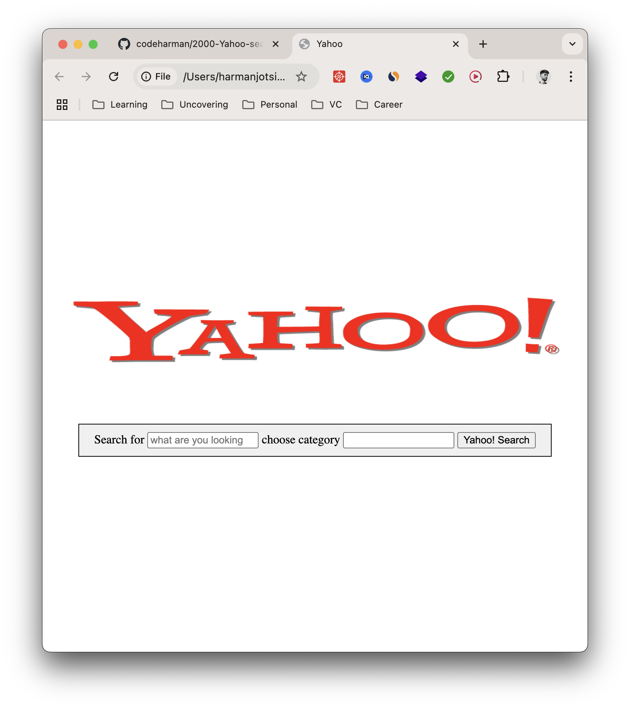

# Yahoo Search Clone

A simple front-end clone of Yahoo's search homepage using HTML and CSS.

## 🚀 Features

- Responsive layout using Flexbox
- Centered Yahoo logo
- Functional search bar with category dropdown
- Clean and minimalist UI

## 🛠️ Tech Stack

- HTML5
- CSS3

## 📦 How to Run

1. Clone the repo: git@github.com:codeharman/2000-Yahoo-search-engine.git

2. Open `index.html` in your browser.

## 🎯 What I Learned

- Flexbox layout techniques
- Accessible form markup
- Basic UI/UX layout replication

## 🧠 Future Improvements

- Mobile responsiveness
- Add animation to search button
- Connect to an API
- Add JavaScript functionality

## 📸 Screenshots
- 

## 🙌 Acknowledgements

Inspired by Yahoo's homepage design.

## 🪪 License

MIT License

